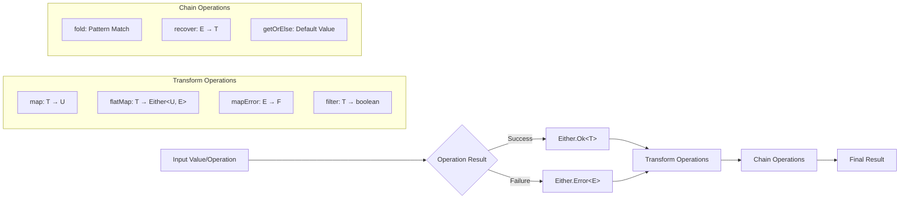
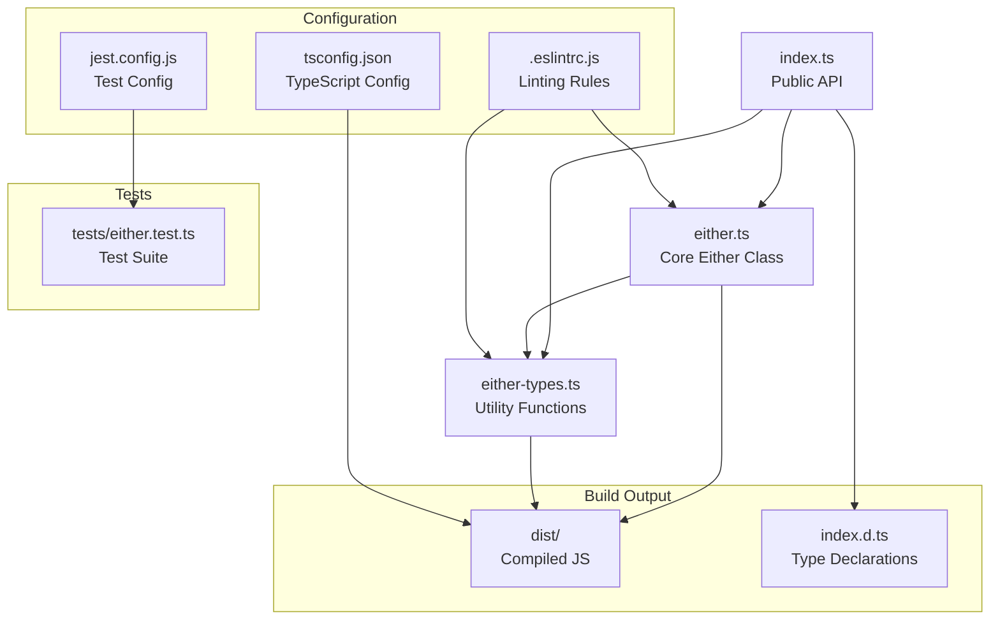

# @redeban/either-monad

A comprehensive TypeScript implementation of the Either monad for functional error handling, providing a complete Result pattern with type-safe operations and extensive utility functions.

## Table of Contents

- [Overview](#overview)
- [Architecture](#architecture)
- [Installation](#installation)
- [Core Concepts](#core-concepts)
- [API Reference](#api-reference)
- [Usage Examples](#usage-examples)
- [Real-World Scenarios](#real-world-scenarios)
- [Development](#development)
- [Contributing](#contributing)

## Overview

The Either monad is a functional programming pattern that represents values with two possibilities: a value of type `Either<T, E>` is either `Ok<T>` containing a success value of type `T`, or `Error<E>` containing an error value of type `E`. This library provides a complete implementation of the Result pattern with comprehensive type safety and utility functions.

### Key Features

- **Type-safe error handling** - Compile-time guarantees for error handling
- **Complete Result pattern** - All standard monadic operations (map, flatMap, fold, etc.)
- **Async support** - Built-in async/await compatibility with `safeAsync`
- **Rich utility functions** - Comprehensive set of helper functions for common operations
- **Zero runtime dependencies** - Lightweight with minimal footprint
- **Full TypeScript support** - Complete type definitions and LSP support
- **Immutable operations** - All transformations return new instances

## Architecture

### System Architecture

```mermaid
graph TB
    subgraph "Core Module"
        Either[Either&lt;T, E&gt; Class]
        OK[OK&lt;T&gt; Type]
        ErrorType[ErrorType&lt;E&gt; Type]
    end
    
    subgraph "Safe Operation Wrappers"
        safeSync[safeSync&lt;&gt;]
        safeAsync[safeAsync&lt;&gt;]
    end
    
    subgraph "Value Conversion Utilities"
        fromNullable[fromNullable&lt;&gt;]
        fromPredicate[fromPredicate&lt;&gt;]
    end
    
    subgraph "Array Processing Utilities"
        sequence[sequence&lt;&gt;]
        partition[partition&lt;&gt;]
        traverse[traverse&lt;&gt;]
        sequenceAll[sequenceAll&lt;&gt;]
    end
    
    subgraph "Method Categories"
        Transform[Transformation Methods<br/>map, flatMap, mapError]
        Combine[Combination Methods<br/>zip, zipWith]
        Filter[Filtering Methods<br/>filter, find]
        Convert[Conversion Methods<br/>toPromise, toOptional, swap]
        Recover[Recovery Methods<br/>recover, recoverWith]
        SideEffect[Side Effect Methods<br/>tap, tapError]
    end
    
    Either --> OK
    Either --> ErrorType
    Either --> Transform
    Either --> Combine
    Either --> Filter
    Either --> Convert
    Either --> Recover
    Either --> SideEffect
    
    safeSync --> Either
    safeAsync --> Either
    fromNullable --> Either
    fromPredicate --> Either
    sequence --> Either
    partition --> Either
    traverse --> Either
    sequenceAll --> Either
```



### Data Flow Diagram



### Module Dependencies



## Installation

```bash
npm install @redeban/either-monad
```

### Requirements

- Node.js >= 14
- TypeScript >= 4.5 (for development)

## Core Concepts

### Either Type System

The `Either<T, E>` type represents a value that can be either successful (`Ok<T>`) or failed (`Error<E>`):

```typescript
type Either<T, E> = Ok<T> | Error<E>
type OK<T> = Either<T, never>        // Success type
type ErrorType<E> = Either<never, E> // Error type
```

### Type Guards and Safe Access

```typescript
import { Either } from '@redeban/either-monad';

const userAge: Either<number, Error> = Either.Ok(25);
const invalidAge: Either<number, Error> = Either.Error(new Error('Invalid age'));

// Type-safe access with type guards
if (userAge.isOk()) {
    // TypeScript knows userAge is OK<number>
    const age: number = userAge.getValue(); // Safe access
    console.log(`User is ${age} years old`);
}

if (invalidAge.isError()) {
    // TypeScript knows invalidAge is ErrorType<Error>
    const errorMessage: string = invalidAge.getError().message;
    console.log(`Error: ${errorMessage}`);
}
```

## API Reference

### Core Either Class

#### Static Constructors

```typescript
/**
 * Creates a successful Either containing a value
 * @param value - The success value
 * @returns OK<T> - Success Either instance
 */
Either.Ok<T>(value: T): OK<T>

/**
 * Creates a failed Either containing an error
 * @param error - The error value
 * @returns ErrorType<E> - Error Either instance
 */
Either.Error<E>(error: E): ErrorType<E>
```

#### Type Guards

```typescript
/**
 * Checks if Either contains a success value
 * @returns true if Either is Ok, false otherwise
 */
isOk(): this is OK<T>

/**
 * Checks if Either contains an error value
 * @returns true if Either is Error, false otherwise
 */
isError(): this is ErrorType<E>
```

#### Value Access Methods

```typescript
/**
 * Extracts the success value (throws if Error)
 * @returns T - The success value
 * @throws Error if called on Error instance
 */
getValue(): T

/**
 * Extracts the error value (throws if Ok)
 * @returns E - The error value
 * @throws Error if called on Ok instance
 */
getError(): E

/**
 * Safely extracts value with fallback
 * @param defaultValue - Value to return if Either is Error
 * @returns T - Either the success value or default value
 */
getOrElse(defaultValue: T): T
```

#### Pattern Matching

```typescript
/**
 * Pattern matching for Either values
 * @param expressions - Object with handlers for Ok and Error cases
 * @returns R - Result of applying the appropriate handler
 */
fold<R>(expressions: {
    fnOk: (value: T) => R,
    fnError: (error: E) => R
}): R
```

### Transformation Methods

```typescript
/**
 * Transforms the success value if Ok, otherwise returns Error unchanged
 * @param fn - Transformation function
 * @returns Either<U, E> - New Either with transformed value
 */
map<U>(fn: (value: T) => U): Either<U, E>

/**
 * Chains Either-returning operations (monadic bind)
 * @param fn - Function that returns an Either
 * @returns Either<U, E> - Flattened result
 */
flatMap<U>(fn: (value: T) => Either<U, E>): Either<U, E>

/**
 * Transforms the error value if Error, otherwise returns Ok unchanged
 * @param fn - Error transformation function
 * @returns Either<T, F> - Either with transformed error type
 */
mapError<F>(fn: (error: E) => F): Either<T, F>
```

### Combination Methods

```typescript
/**
 * Combines two Either values into a tuple
 * @param other - Another Either to combine with
 * @returns Either<[T, U], E> - Tuple of both values or first error
 */
zip<U>(other: Either<U, E>): Either<[T, U], E>

/**
 * Combines two Either values using a function
 * @param other - Another Either to combine with
 * @param fn - Function to combine the values
 * @returns Either<R, E> - Combined result or first error
 */
zipWith<U, R>(other: Either<U, E>, fn: (a: T, b: U) => R): Either<R, E>
```

### Filtering Methods

```typescript
/**
 * Filters the success value with a predicate
 * @param predicate - Function to test the value
 * @param error - Error to return if predicate fails
 * @returns Either<T, E> - Original Either or Error
 */
filter(predicate: (value: T) => boolean, error: E): Either<T, E>

/**
 * Alias for flatMap (functional programming convention)
 * @param fn - Function that returns an Either
 * @returns Either<U, E> - Result of the function
 */
find<U>(fn: (value: T) => Either<U, E>): Either<U, E>
```

### Conversion Methods

```typescript
/**
 * Converts Either to Promise (resolves Ok, rejects Error)
 * @returns Promise<T> - Promise that resolves with value or rejects with error
 */
toPromise(): Promise<T>

/**
 * Converts Either to optional value
 * @returns T | undefined - Value if Ok, undefined if Error
 */
toOptional(): T | undefined

/**
 * Swaps the Ok and Error positions
 * @returns Either<E, T> - Either with swapped types
 */
swap(): Either<E, T>
```

### Recovery Methods

```typescript
/**
 * Recovers from error with a function
 * @param fn - Function to convert error to success value
 * @returns Either<T, never> - Always returns Ok
 */
recover(fn: (error: E) => T): Either<T, never>

/**
 * Recovers from error with an Either-returning function
 * @param fn - Function that returns an Either
 * @returns Either<T, E> - Result of recovery or original Ok
 */
recoverWith(fn: (error: E) => Either<T, E>): Either<T, E>
```

### Side Effect Methods

```typescript
/**
 * Executes a side effect on success value without changing Either
 * @param fn - Side effect function
 * @returns Either<T, E> - Original Either unchanged
 */
tap(fn: (value: T) => void): Either<T, E>

/**
 * Executes a side effect on error value without changing Either
 * @param fn - Side effect function for errors
 * @returns Either<T, E> - Original Either unchanged
 */
tapError(fn: (error: E) => void): Either<T, E>
```

### Utility Functions

#### Safe Operation Wrappers

```typescript
/**
 * Wraps a synchronous operation that may throw
 * @param args.fn - Function to execute safely
 * @param args.ErrClass - Error constructor for caught exceptions
 * @returns Either<T, E> - Success or wrapped error
 */
safeSync<T, E extends Error>(args: {
    fn: () => T,
    ErrClass: Constructor<E>
}): Either<T, E>

/**
 * Wraps an asynchronous operation that may throw
 * @param args.fn - Async function to execute safely
 * @param args.ErrClass - Error constructor for caught exceptions
 * @returns Promise<Either<T, E>> - Promise of Either result
 */
safeAsync<T, E extends Error>(args: {
    fn: () => PromiseLike<T>,
    ErrClass: Constructor<E>
}): Promise<Either<T, E>>
```

#### Value Conversion Utilities

```typescript
/**
 * Converts nullable value to Either
 * @param value - Value that might be null or undefined
 * @returns Either<T, Error> - Ok if value exists, Error otherwise
 */
fromNullable<T>(value: T | null | undefined): Either<T, Error>

/**
 * Creates Either based on predicate test
 * @param value - Value to test
 * @param predicate - Test function
 * @param error - Error to return if predicate fails
 * @returns Either<T, Error> - Ok if predicate passes, Error otherwise
 */
fromPredicate<T>(
    value: T,
    predicate: (value: T) => boolean,
    error: Error
): Either<T, Error>
```

#### Array Processing Utilities

```typescript
/**
 * Combines array of Either values into Either of array
 * @param eithers - Array of Either values
 * @returns Either<T[], E> - Array of all values or first error
 */
sequence<T, E>(eithers: Either<T, E>[]): Either<T[], E>

/**
 * Separates Either array into success and error arrays
 * @param eithers - Array of Either values
 * @returns [T[], E[]] - Tuple of success and error arrays
 */
partition<T, E>(eithers: Either<T, E>[]): [T[], E[]]

/**
 * Maps array values to Either and sequences the results
 * @param values - Array of input values
 * @param fn - Function that converts value to Either
 * @returns Either<U[], E> - Array of results or first error
 */
traverse<T, U, E>(values: T[], fn: (value: T) => Either<U, E>): Either<U[], E>

/**
 * Sequences Either array, collecting all errors if any exist
 * @param eithers - Array of Either values
 * @returns Either<T[], E[]> - All values or all errors
 */
sequenceAll<T, E>(eithers: Either<T, E>[]): Either<T[], E[]>
```

## Usage Examples

### Basic Either Operations

```typescript
import { Either } from '@redeban/either-monad';

// Creating Either values
const validUser = Either.Ok({ 
    id: 123, 
    name: 'Alice Johnson', 
    email: 'alice@example.com' 
});

const invalidUser = Either.Error(new Error('User not found'));

// Type-safe value access
if (validUser.isOk()) {
    const user = validUser.getValue();
    console.log(`Welcome, ${user.name}!`); // Welcome, Alice Johnson!
}

// Safe value extraction with default
const userName = validUser
    .map(user => user.name)
    .getOrElse('Anonymous User');

console.log(userName); // Alice Johnson
```

### Safe Operations with safeSync and safeAsync

```typescript
import { safeSync, safeAsync } from '@redeban/either-monad';

// Safe synchronous operations
const divisionResult = safeSync({
    fn: () => {
        const dividend = 100;
        const divisor = 0;
        if (divisor === 0) {
            throw new Error('Division by zero is not allowed');
        }
        return dividend / divisor;
    },
    ErrClass: Error
});

divisionResult.fold({
    fnOk: (quotient) => console.log(`Result: ${quotient}`),
    fnError: (error) => console.log(`Calculation failed: ${error.message}`)
});

// Safe asynchronous operations
const fetchUserProfile = async (userId: string) => {
    const profileResult = await safeAsync({
        fn: () => fetch(`/api/users/${userId}/profile`).then(res => {
            if (!res.ok) throw new Error(`HTTP ${res.status}: ${res.statusText}`);
            return res.json();
        }),
        ErrClass: Error
    });
    
    return profileResult
        .map(profile => ({
            ...profile,
            displayName: `${profile.firstName} ${profile.lastName}`,
            isActive: profile.lastLoginDate > Date.now() - 30 * 24 * 60 * 60 * 1000
        }))
        .mapError(error => new Error(`Failed to fetch user profile: ${error.message}`));
};
```

### Chaining and Transformation Operations

```typescript
import { Either, fromNullable, fromPredicate } from '@redeban/either-monad';

interface UserInput {
    email?: string;
    age?: number;
    name?: string;
}

const validateAndProcessUser = (userInput: UserInput) => {
    return fromNullable(userInput.email)
        .flatMap(email => fromPredicate(
            email,
            email => email.includes('@') && email.includes('.'),
            new Error('Invalid email format')
        ))
        .map(email => email.toLowerCase().trim())
        .zip(fromNullable(userInput.age))
        .flatMap(([email, age]) => fromPredicate(
            age,
            age => age >= 18 && age <= 120,
            new Error('Age must be between 18 and 120')
        ).map(validAge => ({ email, age: validAge })))
        .zip(fromNullable(userInput.name))
        .map(([userData, name]) => ({
            ...userData,
            name: name.trim(),
            id: Math.random().toString(36).substr(2, 9),
            createdAt: new Date().toISOString()
        }))
        .recover(error => {
            console.warn(`User validation failed: ${error.message}`);
            return {
                email: 'unknown@example.com',
                age: 0,
                name: 'Unknown User',
                id: 'unknown',
                createdAt: new Date().toISOString()
            };
        });
};

// Usage example
const userResult = validateAndProcessUser({
    email: 'john.doe@example.com',
    age: 28,
    name: '  John Doe  '
});

console.log(userResult.getValue());
// Output: { email: 'john.doe@example.com', age: 28, name: 'John Doe', id: 'abc123def', createdAt: '2023-...' }
```

### Working with Arrays and Collections

```typescript
import { sequence, traverse, partition, sequenceAll } from '@redeban/either-monad';

// Processing multiple user IDs
const userIds = ['user1', 'user2', 'user3', 'invalid-user'];

const fetchMultipleUsers = async (ids: string[]) => {
    // Using traverse to fetch and validate all users
    const userResults = await traverse(ids, async (userId) => {
        return safeAsync({
            fn: () => fetch(`/api/users/${userId}`).then(res => {
                if (!res.ok) throw new Error(`User ${userId} not found`);
                return res.json();
            }),
            ErrClass: Error
        });
    });
    
    return userResults;
};

// Combining validation results
const validateUserEmails = (emails: string[]) => {
    const validationResults = emails.map(email => 
        fromPredicate(
            email,
            email => /^[^\s@]+@[^\s@]+\.[^\s@]+$/.test(email),
            new Error(`Invalid email: ${email}`)
        )
    );
    
    // Get all valid emails or first error
    const allValidEmails = sequence(validationResults);
    
    // Or separate valid and invalid emails
    const [validEmails, invalidEmails] = partition(validationResults);
    
    return {
        allValid: allValidEmails,
        validEmails,
        invalidEmails: invalidEmails.map(err => err.message)
    };
};

// Usage
const emailValidation = validateUserEmails([
    'alice@example.com',
    'invalid-email',
    'bob@company.org',
    'another-invalid'
]);

console.log('Valid emails:', emailValidation.validEmails);
console.log('Invalid emails:', emailValidation.invalidEmails);
```

### Advanced Error Recovery Patterns

```typescript
import { Either, safeAsync } from '@redeban/either-monad';

class NetworkError extends Error {
    constructor(message: string, public statusCode: number) {
        super(message);
        this.name = 'NetworkError';
    }
}

class ValidationError extends Error {
    constructor(message: string, public field: string) {
        super(message);
        this.name = 'ValidationError';
    }
}

const robustApiCall = async (endpoint: string, retries: number = 3) => {
    const attemptRequest = async (attempt: number): Promise<Either<any, Error>> => {
        return safeAsync({
            fn: () => fetch(endpoint).then(res => {
                if (!res.ok) {
                    throw new NetworkError(`Request failed: ${res.statusText}`, res.status);
                }
                return res.json();
            }),
            ErrClass: NetworkError
        }).then(result => 
            result.recoverWith(error => {
                if (error instanceof NetworkError && error.statusCode >= 500 && attempt < retries) {
                    console.log(`Attempt ${attempt} failed, retrying...`);
                    return attemptRequest(attempt + 1);
                }
                return Either.Error(error);
            })
        );
    };
    
    return attemptRequest(1)
        .then(result => result.recover(error => {
            console.error(`All attempts failed: ${error.message}`);
            return { error: true, message: 'Service temporarily unavailable' };
        }));
};

// Pipeline with multiple recovery strategies
const processUserData = async (userData: any) => {
    return Either.Ok(userData)
        .flatMap(data => fromPredicate(
            data,
            data => data && typeof data === 'object',
            new ValidationError('Invalid data format', 'root')
        ))
        .flatMap(data => fromNullable(data.email)
            .mapError(() => new ValidationError('Email is required', 'email')))
        .tap(data => console.log(`Processing user: ${data.email}`))
        .recoverWith(error => {
            if (error instanceof ValidationError) {
                console.warn(`Validation error in ${error.field}: ${error.message}`);
                return Either.Ok({ email: 'default@example.com', validated: false });
            }
            return Either.Error(error);
        })
        .tapError(error => console.error(`Unrecoverable error: ${error.message}`));
};
```

### Modern Async/Await Patterns

```typescript
import { Either, safeAsync, fromNullable, sequence } from '@redeban/either-monad';

// Clean async/await API calls without .then/.catch
const fetchUserData = async (userId: string): Promise<Either<User, Error>> => {
    const userResult = await safeAsync({
        fn: async () => {
            const response = await fetch(`/api/users/${userId}`);
            if (!response.ok) {
                throw new Error(`Failed to fetch user: ${response.statusText}`);
            }
            return response.json();
        },
        ErrClass: Error
    });
    
    return userResult.map(user => ({
        ...user,
        fullName: `${user.firstName} ${user.lastName}`,
        isActive: user.status === 'active'
    }));
};

// Sequential async operations with error handling
const processUserWorkflow = async (userId: string) => {
    // Step 1: Fetch user
    const userResult = await fetchUserData(userId);
    if (userResult.isError()) {
        return Either.Error(`User fetch failed: ${userResult.getError().message}`);
    }
    
    const user = userResult.getValue();
    
    // Step 2: Fetch user preferences
    const preferencesResult = await safeAsync({
        fn: async () => {
            const response = await fetch(`/api/users/${userId}/preferences`);
            return response.json();
        },
        ErrClass: Error
    });
    
    if (preferencesResult.isError()) {
        return Either.Error(`Preferences fetch failed: ${preferencesResult.getError().message}`);
    }
    
    // Step 3: Update user profile
    const updateResult = await safeAsync({
        fn: async () => {
            const response = await fetch(`/api/users/${userId}/profile`, {
                method: 'PUT',
                headers: { 'Content-Type': 'application/json' },
                body: JSON.stringify({
                    ...user,
                    preferences: preferencesResult.getValue(),
                    lastUpdated: new Date().toISOString()
                })
            });
            return response.json();
        },
        ErrClass: Error
    });
    
    return updateResult.map(updatedUser => ({
        success: true,
        user: updatedUser,
        message: 'User profile updated successfully'
    }));
};

// Parallel async operations with Either
const fetchUserDashboardData = async (userId: string) => {
    // Execute multiple async operations in parallel
    const [userResult, ordersResult, notificationsResult] = await Promise.all([
        safeAsync({
            fn: async () => {
                const response = await fetch(`/api/users/${userId}`);
                return response.json();
            },
            ErrClass: Error
        }),
        safeAsync({
            fn: async () => {
                const response = await fetch(`/api/users/${userId}/orders`);
                return response.json();
            },
            ErrClass: Error
        }),
        safeAsync({
            fn: async () => {
                const response = await fetch(`/api/users/${userId}/notifications`);
                return response.json();
            },
            ErrClass: Error
        })
    ]);
    
    // Combine all results using sequence
    const combinedResult = sequence([userResult, ordersResult, notificationsResult]);
    
    return combinedResult.map(([user, orders, notifications]) => ({
        user,
        orders,
        notifications,
        summary: {
            totalOrders: orders.length,
            unreadNotifications: notifications.filter(n => !n.read).length,
            lastLoginDate: user.lastLoginDate
        }
    }));
};

// Error recovery with async/await
const robustDataFetch = async (url: string, maxRetries: number = 3) => {
    let lastError: Error | null = null;
    
    for (let attempt = 1; attempt <= maxRetries; attempt++) {
        const result = await safeAsync({
            fn: async () => {
                const response = await fetch(url);
                if (!response.ok) {
                    throw new Error(`HTTP ${response.status}: ${response.statusText}`);
                }
                return response.json();
            },
            ErrClass: Error
        });
        
        if (result.isOk()) {
            return result;
        }
        
        lastError = result.getError();
        
        if (attempt < maxRetries) {
            console.log(`Attempt ${attempt} failed, retrying in ${attempt * 1000}ms...`);
            await new Promise(resolve => setTimeout(resolve, attempt * 1000));
        }
    }
    
    return Either.Error(new Error(`All ${maxRetries} attempts failed. Last error: ${lastError?.message}`));
};

// Async validation pipeline
const validateAndCreateUser = async (userData: {
    email: string;
    username: string;
    password: string;
}) => {
    // Step 1: Validate email uniqueness
    const emailCheckResult = await safeAsync({
        fn: async () => {
            const response = await fetch(`/api/users/check-email`, {
                method: 'POST',
                headers: { 'Content-Type': 'application/json' },
                body: JSON.stringify({ email: userData.email })
            });
            const data = await response.json();
            if (data.exists) {
                throw new Error('Email already exists');
            }
            return data;
        },
        ErrClass: Error
    });
    
    if (emailCheckResult.isError()) {
        return Either.Error(`Email validation failed: ${emailCheckResult.getError().message}`);
    }
    
    // Step 2: Validate username uniqueness
    const usernameCheckResult = await safeAsync({
        fn: async () => {
            const response = await fetch(`/api/users/check-username`, {
                method: 'POST',
                headers: { 'Content-Type': 'application/json' },
                body: JSON.stringify({ username: userData.username })
            });
            const data = await response.json();
            if (data.exists) {
                throw new Error('Username already exists');
            }
            return data;
        },
        ErrClass: Error
    });
    
    if (usernameCheckResult.isError()) {
        return Either.Error(`Username validation failed: ${usernameCheckResult.getError().message}`);
    }
    
    // Step 3: Create user
    const createUserResult = await safeAsync({
        fn: async () => {
            const response = await fetch('/api/users', {
                method: 'POST',
                headers: { 'Content-Type': 'application/json' },
                body: JSON.stringify({
                    ...userData,
                    createdAt: new Date().toISOString(),
                    id: crypto.randomUUID()
                })
            });
            return response.json();
        },
        ErrClass: Error
    });
    
    return createUserResult.map(newUser => ({
        success: true,
        user: newUser,
        message: 'User created successfully'
    }));
};

// Async file processing with Either
const processUploadedFiles = async (files: File[]) => {
    const processFile = async (file: File) => {
        return safeAsync({
            fn: async () => {
                // Validate file
                if (file.size > 5 * 1024 * 1024) { // 5MB limit
                    throw new Error(`File ${file.name} is too large`);
                }
                
                if (!['image/jpeg', 'image/png', 'image/gif'].includes(file.type)) {
                    throw new Error(`File ${file.name} has invalid type`);
                }
                
                // Upload file
                const formData = new FormData();
                formData.append('file', file);
                
                const response = await fetch('/api/upload', {
                    method: 'POST',
                    body: formData
                });
                
                if (!response.ok) {
                    throw new Error(`Upload failed for ${file.name}`);
                }
                
                return response.json();
            },
            ErrClass: Error
        });
    };
    
    // Process all files in parallel
    const results = await Promise.all(files.map(processFile));
    
    // Separate successful and failed uploads
    const [successfulUploads, failedUploads] = partition(results);
    
    return {
        successful: successfulUploads,
        failed: failedUploads.map(error => error.message),
        summary: {
            total: files.length,
            successful: successfulUploads.length,
            failed: failedUploads.length
        }
    };
};
```

## Real-World Scenarios

### Database Operations with Error Handling

```typescript
import { Either, safeAsync } from '@redeban/either-monad';

interface DatabaseConfig {
    host: string;
    port: number;
    database: string;
}

class DatabaseError extends Error {
    constructor(message: string, public code: string) {
        super(message);
        this.name = 'DatabaseError';
    }
}

const connectToDatabase = async (config: DatabaseConfig) => {
    return safeAsync({
        fn: async () => {
            // Simulated database connection
            if (!config.host) throw new Error('DB_HOST_MISSING');
            if (config.port < 1 || config.port > 65535) throw new Error('DB_INVALID_PORT');
            
            // Simulate connection logic
            return { connected: true, connectionId: Math.random().toString(36) };
        },
        ErrClass: DatabaseError
    });
};

const executeQuery = async (connection: any, query: string) => {
    return safeAsync({
        fn: async () => {
            if (!query.trim()) throw new Error('EMPTY_QUERY');
            if (query.toLowerCase().includes('drop')) throw new Error('DANGEROUS_QUERY');
            
            // Simulate query execution
            return { rows: [{ id: 1, name: 'Sample Data' }], rowCount: 1 };
        },
        ErrClass: DatabaseError
    });
};

const databaseOperation = async (config: DatabaseConfig, query: string) => {
    const connection = await connectToDatabase(config);
    
    return connection
        .flatMap(async conn => await executeQuery(conn, query))
        .then(result => result
            .map(queryResult => ({
                success: true,
                data: queryResult.rows,
                count: queryResult.rowCount
            }))
            .recover(error => ({
                success: false,
                error: error.message,
                data: [],
                count: 0
            }))
        );
};
```

### Form Validation Pipeline

```typescript
import { Either, fromPredicate, traverse } from '@redeban/either-monad';

interface FormData {
    username: string;
    email: string;
    password: string;
    confirmPassword: string;
    age: number;
}

interface ValidationRule<T> {
    field: keyof FormData;
    validator: (value: T) => boolean;
    message: string;
}

const validationRules: ValidationRule<any>[] = [
    {
        field: 'username',
        validator: (username: string) => username.length >= 3 && username.length <= 20,
        message: 'Username must be between 3 and 20 characters'
    },
    {
        field: 'email',
        validator: (email: string) => /^[^\s@]+@[^\s@]+\.[^\s@]+$/.test(email),
        message: 'Please enter a valid email address'
    },
    {
        field: 'password',
        validator: (password: string) => password.length >= 8 && /(?=.*[a-z])(?=.*[A-Z])(?=.*\d)/.test(password),
        message: 'Password must be at least 8 characters with uppercase, lowercase, and number'
    },
    {
        field: 'age',
        validator: (age: number) => age >= 13 && age <= 120,
        message: 'Age must be between 13 and 120'
    }
];

const validateForm = (formData: FormData) => {
    // Validate individual fields
    const fieldValidations = validationRules.map(rule => 
        fromPredicate(
            formData[rule.field],
            rule.validator,
            new Error(`${rule.field}: ${rule.message}`)
        )
    );
    
    // Check password confirmation
    const passwordConfirmation = fromPredicate(
        formData.confirmPassword,
        (confirm) => confirm === formData.password,
        new Error('confirmPassword: Passwords do not match')
    );
    
    // Combine all validations
    const allValidations = [...fieldValidations, passwordConfirmation];
    
    return sequence(allValidations)
        .map(() => ({
            isValid: true,
            data: {
                username: formData.username.toLowerCase(),
                email: formData.email.toLowerCase(),
                hashedPassword: `hashed_${formData.password}`, // In real app, use proper hashing
                age: formData.age,
                createdAt: new Date().toISOString()
            },
            errors: []
        }))
        .recover(firstError => {
            // Get all validation errors
            const [, errors] = partition(allValidations);
            return {
                isValid: false,
                data: null,
                errors: errors.map(err => err.message)
            };
        });
};

// Usage example
const formSubmission = validateForm({
    username: 'johndoe',
    email: 'john@example.com',
    password: 'SecurePass123',
    confirmPassword: 'SecurePass123',
    age: 25
});

console.log(formSubmission.getValue());
```

## Development

### Project Structure

```
@redeban/either-monad/
├── src/
│   ├── either.ts              # Core Either class with all methods
│   ├── either-types.ts        # Utility functions and type definitions
│   └── index.ts              # Public API exports
├── tests/
│   └── either.test.ts        # Comprehensive test suite
├── dist/                     # Compiled JavaScript output
├── index.d.ts               # TypeScript declarations
├── tsconfig.json            # TypeScript configuration
├── jest.config.js           # Jest test configuration
├── .eslintrc.js            # ESLint configuration
├── package.json            # Package configuration
└── README.md               # This documentation
```

### Build and Development Commands

```bash
# Install dependencies
npm install

# Run tests with coverage
npm test

# Lint code
npm run lint

# Build distribution files
npm run build

# Prepare for publishing (runs build automatically)
npm run prepublishOnly

# Watch mode for development
npm run test -- --watch
```

### TypeScript Configuration

The project uses strict TypeScript settings for maximum type safety:

```json
{
  "compilerOptions": {
    "target": "ES2020",
    "module": "commonjs",
    "lib": ["ES2020"],
    "strict": true,
    "declaration": true,
    "declarationMap": true,
    "sourceMap": true
  }
}
```

### Testing Strategy

Tests cover all functionality with focus on:
- **Type safety validation** - Ensuring TypeScript types work correctly
- **Method behavior** - Testing all Either methods and utility functions
- **Error scenarios** - Validating error handling and edge cases
- **Integration patterns** - Testing real-world usage patterns

### Code Quality Standards

- **ESLint** with TypeScript rules for consistent code style
- **Strict TypeScript** compilation with no implicit any
- **100% test coverage** target for all public APIs
- **Functional programming** patterns throughout
- **Immutable operations** - all methods return new instances
- **Pure functions** - no side effects in core logic

## Contributing

### Development Guidelines

1. **Type Safety First**: All code must maintain strict type safety
2. **Immutability**: All operations should be immutable and return new instances
3. **Pure Functions**: Avoid side effects in core logic (except for `tap` methods)
4. **Comprehensive Testing**: New features require full test coverage
5. **Documentation**: Update README and JSDoc comments for API changes

### Coding Standards

- Use functional programming patterns consistently
- Prefer composition over inheritance
- Write self-documenting code with meaningful variable names
- Follow existing naming conventions (camelCase for functions, PascalCase for types)
- Add comprehensive JSDoc comments for all public APIs
- Use descriptive error messages

### Pull Request Process

1. **Fork** the repository and create a feature branch
2. **Implement** your changes following the coding standards
3. **Write tests** for new functionality with good coverage
4. **Update documentation** including README and JSDoc comments
5. **Ensure all tests pass** and linting is clean
6. **Submit pull request** with clear description of changes

### Release Process

1. Update version in `package.json`
2. Update `CHANGELOG.md` with new features and fixes
3. Run `npm run prepublishOnly` to build and test
4. Create git tag with version number
5. Publish to npm registry

## License

MIT License - see LICENSE file for details.

## Changelog

### v1.0.0
- Initial release with complete Either monad implementation
- Full Result pattern support with 20+ methods
- Comprehensive utility functions (`safeSync`, `safeAsync`, `sequence`, etc.)
- Complete TypeScript declarations with LSP support
- Extensive test suite with 100% coverage
- Detailed documentation with real-world examples